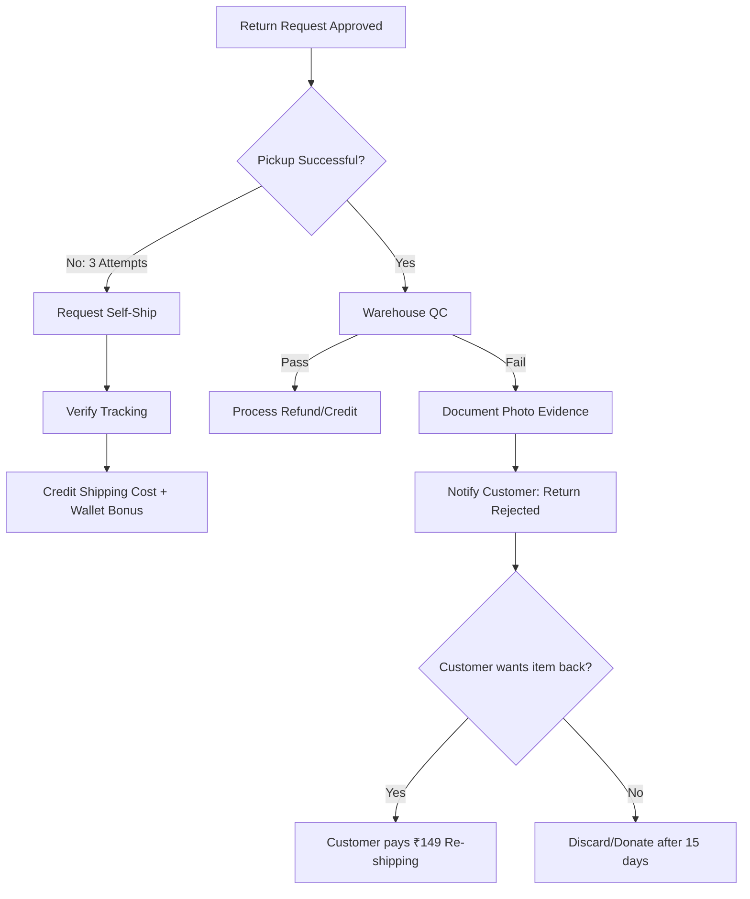

# 🛡️ Stress & Failure Handling SOP

**Status:** 🟢 Active

**Related Page:** [🔄 Return & Refund Policy](https://www.google.com/search?q=link_your_other_notion_page_here)

**Last Updated:** April 2026

---

## 😤 1. Stress Handling: Conflict Resolution

*Goal: To protect the brand’s bottom line while de-escalating customer frustration.*

### A. Communication Guardrails

> 💡 **Tip:** Always use the "Sandwich Method": Empathy → Policy Statement → Solution/Incentive.
> 

| **Scenario** | **The "Stress" Point** | **Standard Response Protocol** |
| --- | --- | --- |
| **Fee Pushback** | Customer refuses to pay ₹99/₹149/₹199 deductions. | Explain that these are direct costs for courier and sanitization. Offer a **₹50 "Loyalty Bonus"** in their Wallet to offset the sting. |
| **Missing Video** | Damage claim without an Unpacking Video. | "While the video is mandatory for logistics insurance, let me check with our warehouse lead if your photos provide enough evidence for a one-time exception." |
| **Late Request** | Customer is on Day 5 (Policy limit is 3). | Stand firm on the 3-day limit for hygiene/inventory reasons. Offer a **one-time 10% discount code** for a future order instead. |

### B. Internal De-escalation

- **The "3-Minute Buffer":** If a customer is being abusive via chat, agents are permitted to "Mute" the chat for 3 minutes to regain composure.
- **The Manager Flag:** Tag any conversation involving "Legal Action," "Consumer Court," or "Social Media/Twitter" with the **[🚨 URGENT]** tag for immediate supervisor takeover.

---

## ⚠️ 2. Failure Handling: Logistics & QC Errors

*Goal: Systematizing what to do when the return process breaks.*

### A. Logistics Failures (Pickup Issues)

- **Scenario: Pickup not done after 3 attempts.**
    - **Action:** Contact the courier API partner to verify the "Reason Code."
    - **Customer Instruction:** Ask the customer to self-ship.
    - **Compensation:** Refund the full shipping cost + **50 Lagorii Wallet Credits** for the inconvenience.
- **Scenario: Item lost in transit (Reverse).**
    - **Action:** If the tracking shows "Pick up done" but no further movement for 7 days, process the **Store Credit** immediately. Do not make the customer wait for the insurance claim.

### B. Warehouse/QC Failures

- **Scenario: Failed Quality Check (Used/Damaged).**
    - **Action:** Warehouse must take 3 photos (Tag, Stain/Damage, Shipping Label).
    - **Resolution:** Reject the return. If the customer wants the item back, they must pay a **Re-shipping Fee of ₹149**.
- **Scenario: Wrong Item Returned (Fraud).**
    - **Action:** Immediately blacklist the email/phone number. Notify the customer that the refund is voided.

---

## 🛠️ 3. Visual Failure Logic

Code snippet

# 

---

## 📝 4. Support Team Check-ins

- **Weekly Sync:** Discuss the "Angriest Customer of the Week" and how it was handled.
- **Wallet Quota:** Each agent has a **₹500/week "Goodwill Buffer"** to use for resolving stress cases without needing manager approval.

---
