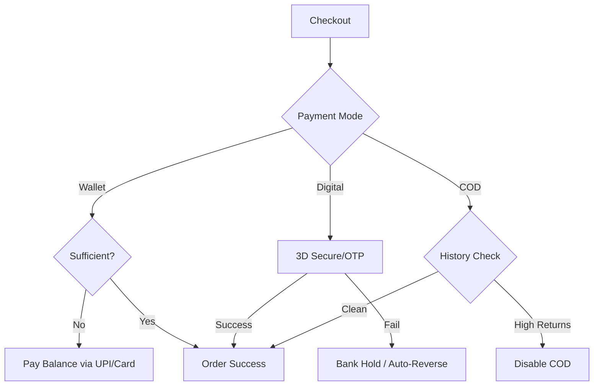

# 💳 Payments, Credits & Security SOP

> **Owner:** Finance / Customer Support
> 
> 
> **Last Audit:** April 2026
> 
> **Compliance:** PCI-DSS & SHA-256 RSA Encryption
> 

---

## 💵 1. Accepted Payment Methods

*Quick view for support agents to verify available options for customers.*

| **Method** | **Region** | **Notes** |
| --- | --- | --- |
| **UPI** | India | Recommended for fast checkout. |
| **Credit/Debit Cards** | Global | Visa, Mastercard, Amex, RuPay, Maestro. |
| **PayPal** | International | Preferred for non-INR transactions. |
| **Net Banking** | India | All major Indian banks supported. |
| **Store Credit** | Global | Can be combined with any method above. |
| **COD** | India | ⚠️ Subject to account eligibility. |

---

## 🎁 2. Store Credits & Gift Cards

> [! TIP] **Strategy:** Always encourage Store Credit for returns to reduce cash outflow and increase customer lifetime value.
> 
- **Validity:** Never expire.
- **Application:** Enter in the **'Gift card or discount code'** field at checkout.
- **Logic:** * If **Credit > Order Total**: Balance remains in the wallet.
    - If **Credit < Order Total**: Customer pays the difference via another method.
- **Security:** Credits are non-transferable and linked to the account email.

---

## 🔒 3. Security & Transaction Integrity

### **Technical Standards**

- [ ]  **PCI-DSS Compliant:** No card data is stored on Lagorii servers.
- [ ]  **3-D Secure:** Mandatory OTP for card transactions.
- [ ]  **Data Privacy:** Cardholder names and details are encrypted.

### **Failed Payments Protocol**

> [! CAUTION] **Bank Holds**
> 
> 
> If a customer's money is deducted but the order fails:
> 
> 1. It is a temporary **Bank Hold**.
> 2. **We do not** have the funds yet.
> 3. The bank will auto-reverse this in 3-7 business days.
> 4. **Action:** Advise customer to check with their bank; do not manually confirm the order.

---

## 🚫 4. COD Eligibility Rules

*COD is a restricted payment method to prevent logistics loss.*

- **Standard Eligibility:** Available for orders where the address is serviceable.
- **The Blacklist:** COD is automatically disabled for users with:
    1. Repeated delivery rejections at the doorstep.
    2. Return rates exceeding **40%** of total order history.
- **Support Response:** "To maintain our service standards, your account is currently eligible for prepaid orders only."

---

## 🛠 5. Visual Flow (Mermaid Block)

Code snippet

---

###
