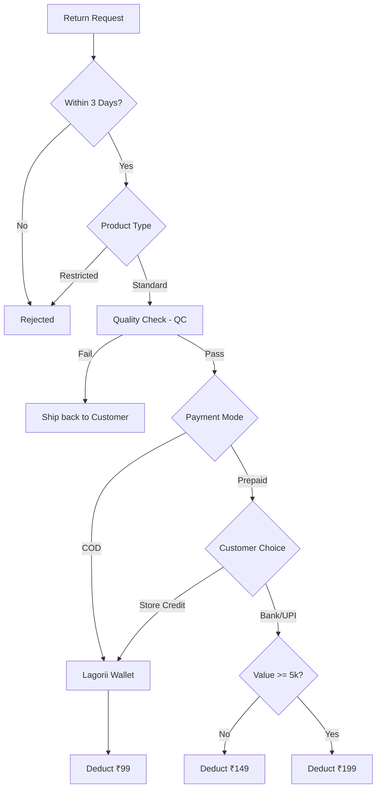

---

# 🔄  Return & Refund SOP

**Status:** 🟢 Active

**Policy Version:** 2025.1

**Key Goal:** Minimize cash outflows by incentivizing Store Credits.

---

## 🗓️ 1. Critical Return Windows

| **Action** | **Timeline** |
| --- | --- |
| **Return Request** | Within **3 days** of delivery |
| **QC & Wallet Credit** | Within **48 hours** of receipt |
| **Bank/UPI Refund** | **5–7 business days** post-QC |
| **International Return** | Must reach warehouse within **20 days** |

---

## 🚫 2. Non-Returnable Categories

The following items are **Final Sale** and cannot be returned under any circumstances:

- **Hygiene Items:** Innerwear, Socks, Hair Accessories.
- **Customized:** Any personalized products.
- **Promotional:** Clearance or "Final Sale" tagged items.

---

## 💸 3. Refund & Deduction Matrix

*Fees are applied **per item**, not per order.*

### **A. Domestic (India)**

| **Payment Method** | **Refund Choice** | **Deduction** | **Notes** |
| --- | --- | --- | --- |
| **COD** | Lagorii Wallet | **₹99** | Only option for COD. |
| **Prepaid** | Lagorii Wallet | **₹99** | Instant (48 hrs). |
| **Prepaid** | Bank/UPI (<₹5k) | **₹149** | Takes 5-7 days. |
| **Prepaid** | Bank/UPI (>₹5k) | **₹199** | Takes 5-7 days. |

### **B. International**

- **Reverse Pickup:** Not available. Customer must self-ship.
- **Deduction:** ₹99 for Store Credit or 5% processing fee for original payment mode.

---

## 📦 4. Cancellation Fees

- **Before Dispatch:** 2% Bank processing fee.
- **After Dispatch:** ₹149 flat fee.
- **COD Specific:** The ₹100 COD handling fee is **never** refundable.

---

## 🛠️ 5. Visual Return Logic (Mermaid)

Code snippet

---

## 📝 6. SOP for Customer Support (Claims)

1. **Damage Claims:** Must be supported by an **Unpacking Video**. If no video is provided, the claim may be rejected.
2. **No Exchanges:** Do not offer direct swaps. Instruct the customer to return for credit and place a **New Order**.
3. **Gift Cards:** Any order paid via Gift Card **must** be refunded to the Gift Card/Wallet, never to a bank account.

---

###
