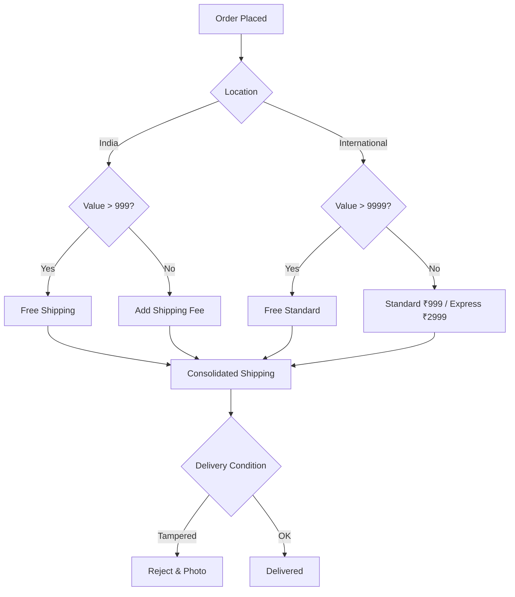

# Customer-handling-SOP

# 📦 Shipping & Logistics SOP

**Status:** 🟢 Active

**Last Updated:** October 2025

**Owner:** Logistics Team / Customer Care

---

## 📑 1. Shipping Rate Matrix

*Quick reference for customer service to verify shipping charges.*

| **Region** | **Order Value** | **Shipping Mode** | **Cost** |
| --- | --- | --- | --- |
| **Domestic (India)** | ₹999+ | Standard | **Free** |
| **Domestic (India)** | < ₹999 | Standard | Calculated at Checkout |
| **International** | ₹9,999+ | Standard | **Free** |
| **International** | < ₹9,999 | Standard | ₹999 |
| **International** | Any | Express | ₹2,999 |

---

## ⚙️ 2. Fulfillment Workflow

### **A. Processing & Packing**

- **Consolidation:** Orders are not split. We ship only when **all items** in a single order ID are ready.
- **Packaging:** Must be **sealed and discreet**. No branding should reveal the internal contents for security.

### **B. Cash on Delivery (COD) Rules**

- **Handling Fee:** A flat **₹100 fee** is applied to all COD orders. This is **non-refundable**.
- **Refund Logic:** COD returns **cannot** be refunded to bank accounts or UPI. They must be issued as **Lagorii Wallet Credits**.
- **SLA:** Credits must be processed within **48 hours** of a successful quality check.

---

## ✈️ 3. International Compliance

- **Customs/Duties:** The customer is the "Importer of Record." They are responsible for all local taxes/customs fees unless specifically collected at checkout.
- **Delivery Protocol:** All international parcels are shipped as **"Signature Not Required."**

---

## 🚨 4. Exception Handling: Damaged/Tampered Goods

If a customer receives a package that appears opened or damaged, the following protocol **must** be followed to eligible for a claim:

1. **Refusal:** The customer must **not** accept the delivery.
2. **Evidence:** Capture clear photos of the outer packaging and the shipping label.
3. **Reporting:** Notify support via WhatsApp (+91 6362348468) or Email (care@lxxxrii.com) immediately.

---

## 🛠 5. Visual Process Flow (Mermaid)

Code snippet

---

## 📞 6. Contact Directory

- **Customer Service:** +91 96202 xxxx
- **Email:** care@yyxx.com
- **Hours:** Mon–Sat · 10am–7pm IST

---

